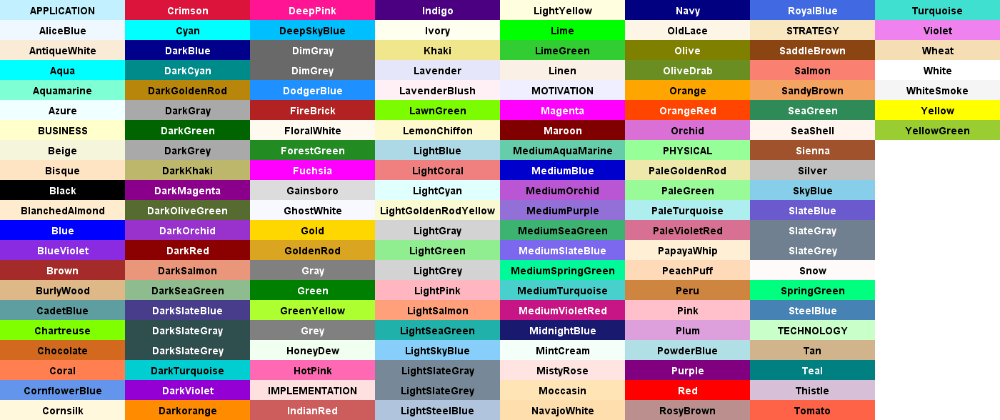

# plant-uml-themes

## ドキュメント

ドキュメントは下表を参照。公式は必要最低限の情報は書いてあるものの、細かな構文について記載がないためわかりにくい。[Ashley's PlantUML Doc](https://plantuml-documentation.readthedocs.io/en/latest/index.html)には構文と指定可能なパラメーター、出力イメージがわかりやすく掲載されているためオススメ。

ドキュメント | URL
-- | --
公式 | https://plantuml.com/ja/sitemap-language-specification
Ashley's PlantUML Doc | https://plantuml-documentation.readthedocs.io/en/latest/index.html
The Hitchhiker's Guide to PlantUML | https://crashedmind.github.io/PlantUMLHitchhikersGuide/

## デザインの変更

`skinparam` でフォントや色、影などの変更が可能。

変更できるパラメーターの一覧は `help skinparams` コマンドで表示できる。

```puml
@startuml
help skinparams
@enduml
```

参考：[Changing colors and fonts：List of all skinparam parameters](https://plantuml.com/ja/skinparam)の

⚠：パラメーターをコピペしたい場合はSVGやASCII Artとして出力すると比較的扱いやすい。

## 文字に関する指定

### フォントの指定

パラメーター | 意味
-- | --
defaultFontName | フォント名を指定する。
classFontColor | フォントの色を指定する。
classFontSize | フォントのサイズを指定する。

参考：[Changing colors and fonts：Font color, name and size](https://plantuml.com/ja/skinparam)

### 文字の配置

パラメーター | 意味
-- | --
sequenceMessageAlign | シーケンスダイアグラムのメッセージの配置指定。`left`, `right`, `center` を指定できる。
sequenceReferenceAlign | `ref over` を使った説明文（リファレンス）の配置指定。`left`, `right`, `center` を指定できる。

[Changing colors and fonts：Text Alignment](https://plantuml.com/ja/skinparam)

## 色の指定

`monochrome` で白黒化することができる。

```
skinparam monochrome true
```

参考：[Changing colors and fonts](https://plantuml.com/ja/skinparam)

`monochrome reverse` で白黒を反転することができる（ダークテーマ化する感じ）。

```
skinparam monochrome reverse
```

参考：[Changing colors and fonts](https://plantuml.com/ja/skinparam)

その他、文字色や背景色の指定には一般的な色の名前も使うことができる。

