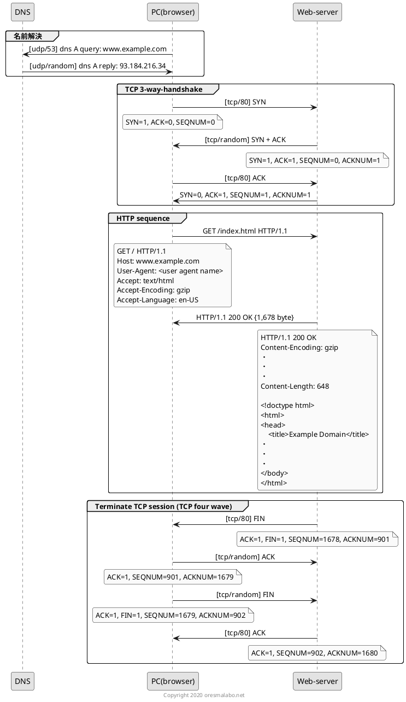

```puml
@startuml
skinparam defaultFontName メイリオ
skinparam monochrome true
skinparam shadowing false
skinparam RoundCorner 7
skinparam SequenceGroupBorderThickness 1
skinparam sequenceMessageAlign center
skinparam sequenceReferenceAlign left

participant DNS as dns
participant "PC(browser)" as pc
participant "Web-server" as server

group 名前解決
  pc -> dns : [udp/53] dns A query: www.example.com
  dns -> pc : [udp/random] dns A reply: 93.184.216.34
end

group TCP 3-way-handshake
  pc -> server: [tcp/80] SYN
  note over pc: SYN=1, ACK=0, SEQNUM=0
  server -> pc: [tcp/random] SYN + ACK
  note over server: SYN=1, ACK=1, SEQNUM=0, ACKNUM=1
  pc -> server: [tcp/80] ACK
  server -> pc: SYN=0, ACK=1, SEQNUM=1, ACKNUM=1
end

group HTTP sequence
  pc -> server: GET /index.html HTTP/1.1
  note over pc
    GET / HTTP/1.1
    Host: www.example.com
    User-Agent: <user agent name>
    Accept: text/html
    Accept-Encoding: gzip
    Accept-Language: en-US
  end note
  server -> pc: HTTP/1.1 200 OK {1,678 byte}
  note over server
    HTTP/1.1 200 OK
    Content-Encoding: gzip
    ・
    ・
    ・
    Content-Length: 648
    
    <!doctype html>
    <html>
    <head>
        <title>Example Domain</title>
    ・
    ・
    ・
    </body>
    </html>
  end note
end

group Terminate TCP session (TCP four wave)
  server -> pc: [tcp/80] FIN
  note over server: ACK=1, FIN=1, SEQNUM=1678, ACKNUM=901
  pc -> server: [tcp/random] ACK
  note over pc: ACK=1, SEQNUM=901, ACKNUM=1679
  pc -> server: [tcp/random] FIN
  note over pc: ACK=1, FIN=1, SEQNUM=1679, ACKNUM=902
  server -> pc: [tcp/80] ACK
  note over server: ACK=1, SEQNUM=902, ACKNUM=1680
end

footer Copyright 2020 oresmalabo.net
@enduml
```